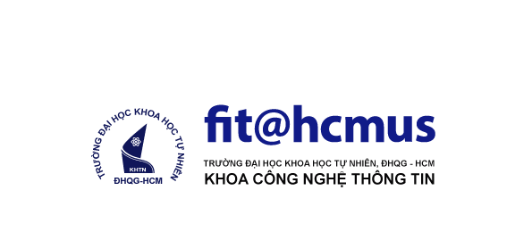

# CSC13002-FE

# NHẬP MÔN CÔNG NGHỆ PHẦN MỀM - HCMUS 

# ĐỒ ÁN QUẢN LÝ HỌC SINH

<p align="center">
  <a href="#">
    
  </a>
</p>

# GIỚI THIỆU NHÓM
Nhóm 14 gồm:

 1. Ngô Đặng Gia Lâm - 19120268
 
 2. Trần Thái San - 20120177
 
 3. Phạm Bảo Huy - 20120298

 4. Phan Phong Lưu - 20120326

# GIỚI THIỆU PHẦN MỀM
Hệ thống quản lý học sinh về cơ bản thực hiện và xây dựng đủ các nội dung sau:

 1. Tiếp nhận học sinh
 
 2. Lập danh sách lớp
 
 3. Tra cứu học sinh
 
 4. Nhập bảng điểm môn
 
 5. Lập báo cáo tổng kết
 
 6. Thay đổi quy định
 
# ĐIỀU KIỆN CÀI ĐẶT

 - Môi trường: 
    - Front-end: Htlm, Css, Javascript, Vuejs
    - Back-end: Nodejs, Express
 
 - Công cụ lập trình: Visual Studio Code
 
# HƯỚNG DẪN CÀI ĐẶT

- Cài đặt môi trường nodejs: https://nodejs.org/en/download/

- Front-end: 
> Chạy theo những lệnh dưới đây
```
$ git clone https://github.com/FaeWulf/CSC13002-FE.git
$ npm install 
$ npm run serve
```

- Back-end:
> Chạy theo những lệnh dưới đây
```
$ git clone https://github.com/FaeWulf/CSC13002-BE.git
$ npm install
$ node server.js
```
